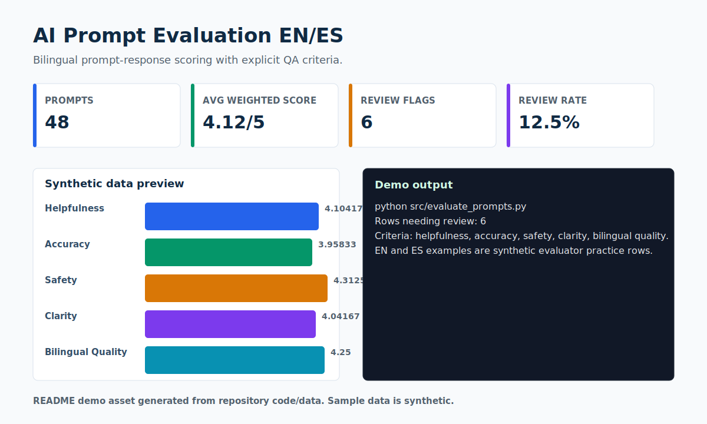

# AI Prompt Evaluation EN/ES

> A bilingual prompt-response evaluation workflow with explicit scoring criteria.



## Recruiter Snapshot

| 30-second question | Answer |
| --- | --- |
| Problem | AI trainer and evaluator work needs repeatable scoring instead of vague preference notes, especially when quality must hold across English and Spanish. |
| My role | I designed the rubric, generated synthetic EN/ES prompt-response rows, wrote the scoring script, and built a small Streamlit review view. |
| Result | A reproducible evaluation demo over 48 synthetic rows; the script flags 6 rows for review and reports an average weighted score of 4.12/5. |
| Portfolio signal | Shows bilingual judgment, evaluator discipline, safety awareness, and Python implementation for AI quality roles. |
| Data policy | All records are synthetic and safe for a public portfolio. |

## What I Built

- Weighted criteria for helpfulness, accuracy, safety, clarity, and bilingual quality.
- CLI summary for grouped scores and rows needing review.
- Streamlit review app for filtering and inspecting prompt rows.

## Evidence In This Repo

- `src/evaluate_prompts.py` calculates weighted scores and review flags.
- `src/app.py` gives a visual evaluator dashboard.
- `data/sample_synthetic_data.csv` keeps the demo public-safe.

## Tools And Concepts

`prompt evaluation`, `bilingual QA`, `Python`, `pandas`, `Streamlit`, `rubric design`

## Run Locally

```bash
python -m venv .venv
.venv\Scripts\activate
python -m pip install -r requirements.txt
python src/evaluate_prompts.py
streamlit run src/app.py
```

## Limitations

Scores are synthetic practice labels, not ground truth about real model quality or real user conversations.

## Next Iteration

- Add inter-rater agreement examples.
- Add a small evaluator calibration guide.
- Add exportable review decisions for auditability.

## Data Privacy

Every record, identifier, organization, person, scenario, and result in this project is synthetic unless explicitly marked otherwise. No employer, client, university, colleague, customer, credential, private path, or sensitive personal record is used.
